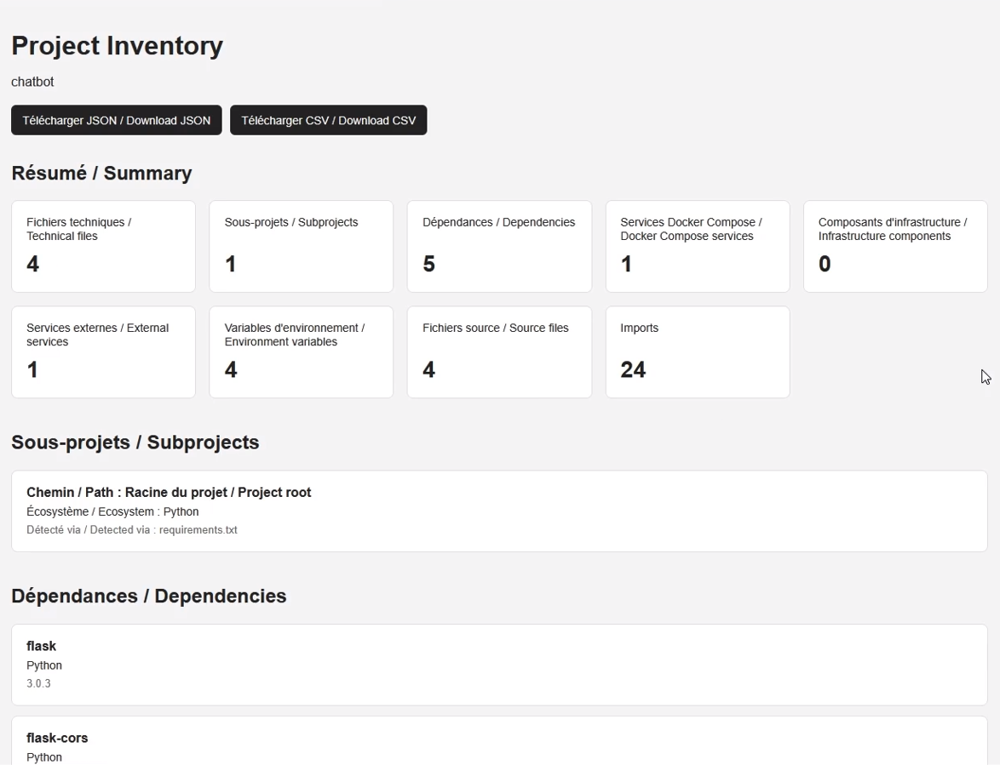

<p align="center">
  
</p>

> 🇬🇧 English | [🇫🇷 Français](./README_FR.md)


[](https://www.youtube.com/watch?v=Bw-s8SEV7rw)
[](https://www.linkedin.com/in/palks-studio/)
[](https://palks-studio.com/en/project-inventory/)

<p align="center">
  <a href="https://palks-studio.com">
    
  </a>
</p>

# Project Inventory

Project Inventory is a local technical analysis and software project mapping tool.

It recursively scans a project directory to identify its technical structure: dependencies, configuration files, Docker infrastructure, environment variables, external services, and Python imports.

The goal is simple: open an existing project, including an unfamiliar or inherited codebase, and quickly obtain a usable overview of what it contains and what it depends on.

> Direct filesystem analysis. No source code or secrets need to be sent to an external service.

> This repository is a technical presentation and documentation repository.  
> It does not contain downloadable source code or production files.

---

## Current Features

### Recursive Project Scanning

Project Inventory is a static analysis and technical mapping tool for software projects, designed for use both locally and on servers.

Generated or irrelevant directories are ignored, including:

- `.git`  
- `.idea`  
- `.vscode`  
- `__pycache__`  
- `node_modules`  
- `vendor`  
- `.venv`  
- `venv`  
- `dist`  
- `build`  
- `coverage`

Detection works both by known filename and, when necessary, by file extension, notably for `.csproj` files.

---

## Dependencies

Project Inventory currently detects dependencies across 10 ecosystems.

### Python

Supported formats:

- `requirements.txt`  
- `pyproject.toml`  
- `poetry.lock`  
- `Pipfile`  
- `Pipfile.lock`

### Node.js

Supported formats:

- `package.json`  
- `package-lock.json`  
- `yarn.lock`  
- `pnpm-lock.yaml`

### PHP

Supported formats:

- `composer.json`  
- `composer.lock`

### Go

Supported formats:

- `go.mod`  
- `go.sum`

### Rust

Supported formats:

- `Cargo.toml`  
- `Cargo.lock`

### Ruby

Supported formats:

- `Gemfile`  
- `Gemfile.lock`

### Java / JVM

Supported formats:

- `pom.xml`  
- `build.gradle`  
- `build.gradle.kts`

### .NET

Supported formats:

- `*.csproj`

### Dart / Flutter

Supported formats:

- `pubspec.yaml`  
- `pubspec.lock`

### Elixir

Supported formats:

- `mix.exs`  
- `mix.lock`

---

## Dependency Consolidation

Dependencies coming from multiple files are consolidated by ecosystem and package.

For example, a dependency found both in a manifest and its lock file is displayed only once, with its different sources:

```text
dio
    pubspec.lock         ==5.7.0 [locked]
    pubspec.yaml         ^5.7.0
```

A dependency discovered only in a lock file is also preserved.

This makes it possible to identify transitive dependencies that are not directly declared in the main manifest.

Packages with the same name in different ecosystems remain separate.

---

## Subprojects

Project Inventory identifies the different technical subprojects present within the same directory tree from detected manifests and configuration files.

Each subproject can be associated with one or more ecosystems, as well as the technical files used to identify it.

This makes it possible, for example, to distinguish a Python backend, a Node.js frontend, or other components with their own manifests within the same repository.

---

## Docker Infrastructure

### Docker Compose

Project Inventory currently detects services declared in:

- `docker-compose.yml`  
- `docker-compose.yaml`  
- `compose.yml`  
- `compose.yaml`

For each detected service, Project Inventory can extract:

- the image used  
- build configuration  
- ports  
- environment files  
- volumes  
- dependencies between services  
- declared environment variables, without exposing their values  
- the container name  
- the restart policy

### Infrastructure Components

Some detected Docker images can be associated with known infrastructure components, including:

- Redis  
- PostgreSQL  
- MySQL  
- MariaDB  
- MongoDB  
- RabbitMQ

These signatures enrich services already discovered by the scanner. They do not replace dynamic analysis of Docker Compose files.

### Component Relationships

Project Inventory builds a technical map of observable relationships between components detected within the project.

Currently represented relationships include:

- dependencies declared by subprojects (`declares`)  
- dependencies between Docker Compose services (`depends_on`)  
- build relationships between Docker Compose services and subprojects (`builds`)  
- environment files used by services (`uses_env_file`)  
- Docker Compose volume mounts (`mounts`)  
- external services used by subprojects (`uses_external_service`)  
- relationships with infrastructure components when they can be established from detected data

Each relationship preserves its type, the source and target component types, and the evidence used to establish it.

Project Inventory does not create a relationship when it cannot be established from files, declarations, or elements actually observed during static analysis.

### Dockerfile

Dockerfile analysis currently extracts:

- `FROM` base images 
- `WORKDIR` directories  
- `EXPOSE` ports  
- `CMD` commands  
- `ENTRYPOINT` declarations

Example:

```text
Base image: python:3.12-slim
Working directory: /app
Exposed port: 5000
Command: ["gunicorn", "-w", "2", "-b", "0.0.0.0:5000", "app:app"]
```

---

## Environment Variables

The following files can be analyzed:

- `.env`  
- `.env.example`  
- `.env.sample`

Project Inventory extracts variable names only.

Values are not displayed in order to avoid exposing API keys, passwords, or other secrets.

Example:

```text
OPENAI_API_KEY
ENABLE_PERSISTENCE
MEMORY_MAX_TURNS
STRICT_MODE
```

---

## External Services

Project Inventory can correlate dependencies and environment variables with signatures of known external services.

Currently integrated signatures include:

- OpenAI  
- Stripe  
- AWS  
- SendGrid  
- Twilio  
- Sentry

A detected service can include multiple pieces of evidence:

```text
OpenAI
    package    openai
    variable   OPENAI_API_KEY
```

Signatures are used to enrich elements already discovered by the scanner. They do not replace dynamic discovery of packages and environment variables.

A package unknown to the signature catalog therefore remains visible in the inventory.

---

## Python Import Analysis

Python source files are analyzed using the Python AST.

Imports are classified into three categories:

- standard library  
- external dependencies  
- internal project modules

Example:

```text
STANDARD PYTHON
  os
  json
  datetime

EXTERNAL
  flask
  openai
  dotenv

INTERNAL
  main
  storage
```

---

## Python Dependency References

Project Inventory currently correlates declared Python dependencies with references found in source code and, where relevant, Docker configuration.

Example:

```text
flask
    REFERENCED
    import flask

gunicorn
    REFERENCED
    Docker ["gunicorn", "-w", "2", ...]
```

The tool deliberately uses the terms **referenced** and **no reference detected**.

The absence of a static reference does not necessarily mean that a dependency is unused at runtime.

---

## Detection Principles

Project Inventory separates two mechanisms.

### Discovery

Technical files tell the scanner where to look and how to interpret their contents.

The contents themselves are discovered dynamically.

For example, Project Inventory does not need to know every existing Python, Node.js, PHP, Go, or Rust package in advance in order to inventory them.

### Enrichment

Specific signatures can then be used to interpret discovered elements.

For example:

```text
OPENAI_API_KEY -> OpenAI
STRIPE_SECRET_KEY -> Stripe
SENTRY_DSN -> Sentry
```

The core principle is:

> Tell the scanner where and how to look, without requiring it to know in advance what it will find.

---

## Installation

Project Inventory requires Python 3.11 or later.

For complete installation instructions and platform-specific commands, see `INSTALL.md`.

---

## Current Usage

From the Project Inventory root directory:

```bash
python app.py
```

The application then asks for the path of the project to analyze:

```text
Path of the project to analyze:
```

Analysis results are displayed in the terminal and automatically exported to the `output` directory.

The currently generated formats are:

- `project-inventory.json`  
- `project-inventory.html`  
- a set of CSV reports in the `output/csv` directory

CSV exports include:

- `dependencies.csv`  
- `dependency_usage.csv`  
- `dockerfiles.csv`  
- `environment_variables.csv`  
- `external_services.csv`  
- `imports.csv`  
- `infrastructure_components.csv`  
- `service_relationships.csv`  
- `services.csv`  
- `source_files.csv`  
- `subprojects.csv`  
- `technical_files.csv`

The HTML report provides a structured and readable view of the inventory.

The JSON file preserves detailed data in a format that can be consumed by other tools.

The CSV files provide specialized exports that can be opened in spreadsheet software or used for further processing.

---

## Project Structure

```text
project-inventory/
├── analyzers
│   ├── __init__.py
│   │   → (FR) Initialise le module d’analyse.
│   │   → (EN) Initializes the analysis module.
│   │
│   ├── dependencies.py
│   │   → (FR) Consolide les dépendances détectées et analyse leurs références dans le projet.
│   │   → (EN) Consolidates detected dependencies and analyzes their references within the project.
│   │
│   └── relationships.py
│       → (FR) Analyse les relations entre les services et composants détectés dans le projet.
│       → (EN) Analyzes relationships between services and components detected within the project.
│
├── detectors
│   ├── __init__.py
│   │   → (FR) Initialise le module des détecteurs.
│   │   → (EN) Initializes the detector module.
│   │
│   ├── environment.py
│   │   → (FR) Détecte les noms des variables d’environnement sans exposer leurs valeurs.
│   │   → (EN) Detects environment variable names without exposing their values.
│   │
│   ├── infrastructure.py
│   │   → (FR) Analyse les fichiers d’infrastructure, notamment Docker Compose et Dockerfile.
│   │   → (EN) Analyzes infrastructure files, including Docker Compose and Dockerfile.
│   │
│   ├── languages.py
│   │   → (FR) Analyse les fichiers source et classe les imports Python.
│   │   → (EN) Analyzes source files and classifies Python imports.
│   │
│   ├── packages.py
│   │   → (FR) Extrait les dépendances depuis les manifestes et lock files des écosystèmes pris en charge.
│   │   → (EN) Extracts dependencies from manifests and lock files across supported ecosystems.
│   │
│   ├── projects.py
│   │   → (FR) Identifie les sous-projets techniques à partir des manifestes et fichiers de configuration détectés.
│   │   → (EN) Identifies technical subprojects from detected manifests and configuration files.
│   │
│   └── services.py
│       → (FR) Identifie les services externes à partir des packages et variables d’environnement détectés.
│       → (EN) Identifies external services from detected packages and environment variables.
│
├── docs
│   ├── CHANGELOG.md
│   │   → (FR) Historique des modifications et évolutions du projet en anglais.
│   │   → (EN) Tracks project changes and development history in English.
│   │
│   ├── CHANGELOG_FR.md
│   │   → (FR) Historique des modifications et évolutions du projet en français.
│   │   → (EN) Tracks project changes and development history in French.
│   │
│   ├── INSTALL.md
│   │   → (FR) Instructions d’installation et d’utilisation en anglais.
│   │   → (EN) Installation and usage instructions in English.
│   │
│   ├── INSTALL_FR.md
│   │   → (FR) Instructions d’installation et d’utilisation en français.
│   │   → (EN) Installation and usage instructions in French.
│   │
│   ├── README.md
│   │   → (FR) Documentation générale et présentation du projet en anglais.
│   │   → (EN) General project documentation and overview in English.
│   │
│   └── README_FR.md
│       → (FR) Documentation générale et présentation du projet en français.
│       → (EN) General project documentation and overview in French.
│
├── exporters
│   ├── __init__.py
│   │   → (FR) Initialise le module d’export des rapports.
│   │   → (EN) Initializes the report export module.
│   │
│   ├── csv_export.py
│   │   → (FR) Génère les rapports d’inventaire au format CSV.
│   │   → (EN) Generates inventory reports in CSV format.
│   │
│   ├── html_export.py
│   │   → (FR) Génère les rapports d’inventaire au format HTML.
│   │   → (EN) Generates inventory reports in HTML format.
│   │
│   └── json_export.py
│       → (FR) Génère les rapports d’inventaire au format JSON.
│       → (EN) Generates inventory reports in JSON format.
│
├── output
│   └── .gitkeep
│       → (FR) Conserve le dossier de sortie dans Git lorsqu’il est vide.
│       → (EN) Keeps the output directory tracked by Git when empty.
│
├── scanner
│   ├── __init__.py
│   │   → (FR) Initialise le module principal de scan du projet.
│   │   → (EN) Initializes the main project scanning module.
│   │
│   ├── filesystem.py
│   │   → (FR) Parcourt récursivement le système de fichiers et détecte les fichiers techniques à analyser.
│   │   → (EN) Recursively scans the filesystem and detects technical files to analyze.
│   │
│   └── project_scanner.py
│       → (FR) Orchestre l’analyse complète du projet et centralise les résultats des différents détecteurs.
│       → (EN) Orchestrates the complete project analysis and centralizes results from the different detectors.
│
├── LICENCE.md
│   → (FR) Définit les conditions de licence et les droits d’utilisation de Project Inventory en français.
│   → (EN) Defines Project Inventory licensing terms and usage rights in French.
│
├── LICENSE.md
│   → (FR) Définit les conditions de licence et les droits d’utilisation de Project Inventory en anglais.
│   → (EN) Defines Project Inventory licensing terms and usage rights in English.
│
└── app.py
    → (FR) Point d’entrée de Project Inventory, affichage des résultats dans le terminal et génération des rapports.
    → (EN) Project Inventory entry point, terminal output and report generation.
```

---

## Product Status

Project Inventory is operational for local static analysis and technical mapping of supported software projects.

Available features include:

- recursive scanning of technical files  
- dependency detection and consolidation across supported ecosystems  
- subproject identification  
- Docker Compose and Dockerfile analysis  
- infrastructure component identification  
- secure extraction of environment variable names  
- external service identification from observed signals  
- Python import analysis and classification  
- correlation between Python dependencies and observed references  
- component relationship mapping  
- terminal output  
- HTML, JSON, and CSV report generation

Project Inventory is operational for static analysis and technical mapping of supported projects, both in local environments and on servers with direct access to the project files.

---

## Philosophy

Project Inventory is not intended to execute the project being analyzed.

It builds a technical map from files, declarations, configurations, and references that can be observed statically.

The report should therefore distinguish between what is:

- discovered  
- declared  
- locked  
- referenced  
- interpreted from a signature

without turning a static observation into a claim about the software's actual runtime behavior.

---

© Palks Studio — see LICENSE.md  
- https://palks-studio.com
